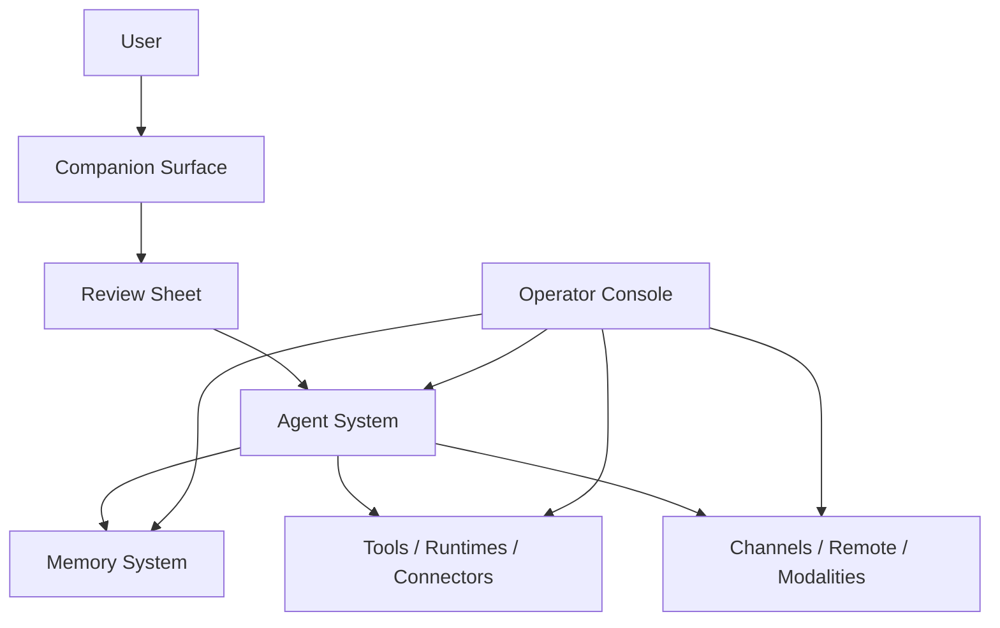

# AgentHub 总体架构

## 1. 架构目标

AgentHub 的架构要服务于一个清晰产品形态：

- 前台是一个轻的 companion
- 中间层是 review / confirm / result 的薄交互
- 后台是任务执行、记忆、工具调用和配置系统

## 2. 分层

## 3. 各层职责

### 3.1 Companion Surface

职责：

- 常驻桌面
- 承载陪伴感
- 接收任务输入
- 展示轻状态
- 在关键时刻唤起用户

不负责：

- 真实任务执行
- 复杂配置
- 深度调试

### 3.2 Review Sheet

职责：

- 快速展示当前任务状态
- 承载确认、决策、审查
- 展示最终结果摘要

它是前台展开层，不是后台控制台。

### 3.3 Agent System

职责：

- 接收任务
- 编排执行
- 管理 thread / task / session / result
- 发起 review / approval
- 和 runtime / tools / connectors 对接

这是整套产品的中轴。

### 3.4 Memory System

职责：

- 保存短期任务上下文
- 保存长期用户偏好和事实
- 提炼环境知识
- 保存任务复盘和经验

记忆应该围绕任务和用户成长，而不是围绕聊天消息堆积。

### 3.5 Tools / Runtimes / Connectors

职责：

- 执行真正的工作
- 访问本地文件、终端、模型、工具
- 承接本地与远端执行能力

这一层应尽可能复用现有 runtime 和 connector，不在平台层重复造核心能力。

### 3.6 Channels / Remote / Modalities

职责：

- 提供不同入口
- 把输入统一转成任务
- 把结果统一送回用户

包括：

- 桌面输入
- iOS
- Feishu
- Remote bridge
- 语音
- 视频
- 文档 / 文件

## 4. 当前系统与未来系统的映射

当前仓库里的桌面 App，未来会一分为二：

- `AgentHub Console`
  - 继续保留
  - 主要服务于配置、调试、深度审查
- `Companion`
  - 作为新前台形态出现
  - 承担普通用户日常交互

当前的协作对象也可以映射到未来模型：

- `thread` 对应工作线
- `task` 对应可执行子任务
- `session` 对应 runtime 执行上下文
- `event` 对应任务生命周期事件
- `board` 对应共享工作记忆的当前视图

## 5. 前台与后台的边界

### 前台必须轻

前台默认只该出现这些信息：

- 当前状态
- 当前任务摘要
- 是否需要确认
- 是否已完成

### 后台允许复杂

后台可以继续保留：

- models
- secrets
- MCP
- runtime settings
- remote hosts
- logs
- diagnostic pages

## 6. 核心设计判断

1. `聊天不是架构中心，任务才是`
2. `记忆不是附属能力，而是中轴层`
3. `channels / voice / video 只是入口`
4. `Companion 是前台，Console 是后台`
5. `对用户合一，对系统分层`

最后一句尤其关键：

- 用户感知到的是“同一个伙伴”
- 系统内部必须把 companion、agent、memory、runtime 分层

这样以后才能稳定扩展。
