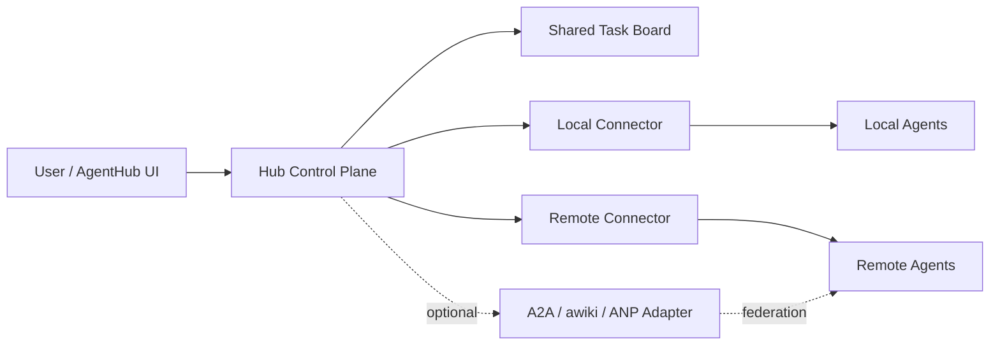

# AgentHub 多 Agent 管理与协作 V1 定义

## 1. 目标

AgentHub 的定位是 **管理优先** 的多 Agent 控制台，而不是替代 Claude、OpenAI、Codex 这些运行时原生会话系统。

V1 目标是把下面三件事拆清楚：

1. **管理层**：本地和远端 Agent 都能被发现、查看、控制、配置。
2. **协作层**：多个 Agent 可以围绕同一条任务线协作，而不是各聊各的。
3. **通信层**：先支持 Hub 内部中转，后续再接 A2A / awiki / ANP 这类联邦协议。

## 2. V1 核心决策

### 2.1 AgentHub 不拥有原生会话，只引用它

- Claude、OpenAI、Codex 这些运行时如果有自己的原生 session，就继续让它们自己维护。
- AgentHub 只保存：
  - 任务线
  - 共享任务板
  - 每个 Agent 在这条任务线下对应的 `runtime_session_id`
  - 关键事件、任务、摘要、产物引用
- AgentHub **不要求**保存完整聊天 transcript 才能工作。

### 2.2 一条任务线可以挂多个 Agent 会话

用户看到的是一条“任务线”，不是一个单独模型聊天框。

例如同一条任务线 `T1` 下可以同时有：

- Claude 会话 `C1`
- OpenAI 会话 `O1`
- Codex 会话 `X1`

切换 Agent 的含义不是“清空重开”，而是：

- 留在同一条任务线内
- 切到另一个 Agent 的会话
- 携带一份共享任务板摘要和当前请求

### 2.3 不走“摘要套摘要”，改走共享任务板

V1 不做 A 给 B、B 再给 A 的链式摘要压缩。

原因：

- 容易重复压缩
- 信息会越来越抽象
- 很难追踪“哪些内容已经交接过”

V1 统一改成：

- 所有 Agent 都围绕一块 **共享任务板** 工作
- Agent 更新的是任务板，不是互相私发摘要
- 每个 Agent 只读取自己上次已读版本之后的增量更新

### 2.4 本地和远端统一为 Connector

AgentHub 不直接假设“Agent 一定在本机”。

V1 统一抽象成 `Connector`：

- 本地 Connector：当前 Tauri 本地能力桥
- 远端 Connector：SSH / HTTP / 自建 daemon / cloud worker gateway

Hub 只跟 Connector 交互，Connector 再去管理具体 runtime。

### 2.5 联邦通信是插件，不是核心控制面

A2A、awiki、ANP 这类协议很适合做：

- Agent 身份
- 联邦发现
- 远端私信 / 群组 / 异步协作

但它们不适合单独承担：

- 进程管理
- 配置读写
- 健康检查
- 启停控制

所以 V1 原则是：

- 核心控制面：AgentHub + Connector
- 联邦通信：A2A / awiki / ANP adapter

## 3. 分层架构

### 3.1 管理层

负责：

- Agent 发现
- 健康检查
- 配置读写
- 启动 / 停止 / 重启
- 日志拉取
- 能力探测

### 3.2 协作层

负责：

- 任务线
- 共享任务板
- 子任务
- Agent 参与关系
- 关键事件
- 交接包生成

### 3.3 通信层

负责：

- Hub 内部转发
- Connector RPC
- 可选的 A2A / awiki / ANP 通信

## 4. V1 范围

### 4.1 必做

1. 本地 / 远端统一 Connector 模型
2. Thread（任务线）模型
3. Board（共享任务板）模型
4. AgentSession（每个 Agent 在任务线内的运行会话）
5. Task（子任务）模型
6. EventLog（关键事件）模型
7. Agent 切换时的 handoff packet 生成

### 4.2 暂不做

1. 全自动自治团队
2. Agent 之间默认直连私信
3. 完整 transcript 重建
4. 多租户权限体系
5. 复杂审批流

## 5. 核心对象

### 5.1 Connector

表示一个可被 Hub 管理的执行入口。

字段建议：

- `id`
- `name`
- `type`: `local | ssh | http | cloud`
- `status`: `online | offline | degraded | unauthorized`
- `location_label`
- `base_url` 或 `host`
- `auth_mode`
- `capabilities`

职责：

- 列出自己下面有哪些 Agent
- 提供 Agent health / config / control 接口
- 提供 task submit / logs / session bridge 能力

### 5.2 ManagedAgent

表示一个具体的 Agent 实例。

字段建议：

- `id`
- `connector_id`
- `agent_type`
- `runtime_family`
- `name`
- `deployment`: `local | remote`
- `status`
- `runtime_capabilities`
- `config_ref`
- `metadata`

注意：

- Agent 是“被管理对象”
- 它不等于“当前聊天页里的单次会话”

### 5.3 Thread

Thread 是用户视角的一条工作线。

例如：

- 修支付回调 bug
- 给文章出一版海报
- 排查 Claude 配置失效问题

字段建议：

- `id`
- `title`
- `goal`
- `status`: `active | paused | completed | archived`
- `default_agent_id`
- `board_id`
- `created_at`
- `updated_at`

### 5.4 AgentSession

表示某个 Agent 在某条任务线里的会话桥接记录。

字段建议：

- `id`
- `thread_id`
- `agent_id`
- `runtime_session_id`
- `mode`: `native | stateless`
- `status`: `idle | running | waiting | error`
- `last_seen_board_version`
- `last_handoff_version`
- `created_at`
- `updated_at`

关键规则：

- 同一 Thread 下，不同 Agent 通常各有一个会话
- 同一 Agent 也允许在同一 Thread 里有多个会话，用于 fork / retry / sandbox

### 5.5 TaskBoard

TaskBoard 是共享状态中心，是 V1 协作的核心。

字段建议：

- `id`
- `thread_id`
- `version`
- `objective`
- `current_focus`
- `summary`
- `decisions`
- `open_questions`
- `key_files`
- `artifacts`
- `updated_by`
- `updated_at`

它不是完整聊天记录，而是适合被不同 Agent 快速接手的结构化上下文。

### 5.6 BoardTask

BoardTask 是任务线下的可分发子任务。

字段建议：

- `id`
- `thread_id`
- `board_id`
- `title`
- `description`
- `status`: `todo | claimed | running | blocked | done | cancelled`
- `assigned_agent_id`
- `priority`
- `depends_on`
- `artifact_refs`
- `created_at`
- `updated_at`

### 5.7 TaskEvent

TaskEvent 用来保留关键过程，而不是保留所有 token 级对话。

字段建议：

- `id`
- `thread_id`
- `board_version`
- `agent_id`
- `session_id`
- `task_id`
- `event_type`
- `title`
- `body`
- `payload`
- `created_at`

V1 事件类型建议：

- `user_message`
- `agent_selected`
- `session_created`
- `session_resumed`
- `summary_updated`
- `task_created`
- `task_claimed`
- `task_completed`
- `artifact_added`
- `handoff_generated`
- `handoff_applied`
- `run_failed`

## 6. Agent 切换流程

以“先 Claude，再 OpenAI，再切回 Claude”为例。

### 第一步：创建任务线

用户在 AgentHub 新建：

- Thread `T1`
- Board `B1`

### 第二步：Claude 首次进入

- Hub 发现 `T1` 下没有 Claude 会话
- 创建 `AgentSession C1`
- 如果 Claude 支持原生 session，则保存 `runtime_session_id`

### 第三步：Claude 工作

Claude 输出的关键结果不必全部入库。

V1 只把关键内容回写到 Board：

- 当前结论
- 新增文件
- 风险点
- 下一步建议

同时写入几个事件：

- `summary_updated`
- `artifact_added`
- `task_completed`

### 第四步：切到 OpenAI

Hub 不重放 Claude 全量聊天，而是生成 handoff packet：

- Thread 目标
- 当前 Board 摘要
- 自 OpenAI 上次已读版本之后的增量
- 当前用户新消息

然后：

- 如果 OpenAI 在 `T1` 下没有会话，创建 `O1`
- 如果已有 `O1`，则恢复 `O1`
- 把 handoff packet 交给 OpenAI

### 第五步：再切回 Claude

Claude 只需要读取：

- 自己 `last_seen_board_version` 之后的 Board 更新
- 当前用户消息

这样就避免“把第一次 Claude 的摘要又压一次”的问题。

## 7. 远端 Agent 管理方式

V1 远端管理不直接通过 A2A 做。

推荐模式：

### 7.1 Local Connector

就是当前 AgentHub Tauri 本地后端。

负责：

- detect agents
- read config
- write config
- launch / stop
- run local runtime bridge

### 7.2 Remote Connector

远端 Connector 可以有三种落地方向：

1. `ssh`
2. `http`
3. `cloud worker gateway`

只要最后对 Hub 暴露统一能力即可。

### 7.3 Connector 最小接口

V1 先统一成下面这些动作：

- `ping`
- `list_agents`
- `get_agent`
- `get_health`
- `read_config`
- `write_config`
- `launch_agent`
- `stop_agent`
- `stream_logs`
- `create_or_resume_session`
- `submit_handoff`

## 8. Agent 间通信模型

V1 只定义三种通信模式：

### 8.1 `hub-board`

默认模式。

- Agent 不直接互发消息
- 全部通过共享任务板同步
- 最易观测、最易调试、最适合第一版

### 8.2 `hub-relay`

由 Hub 代发结构化消息。

适合：

- 指定 Agent 给另一个 Agent 发任务
- 用户希望看到清晰的“谁给谁派了什么”

### 8.3 `federated`

接 A2A / awiki / ANP 等协议。

适合：

- 不同机器
- 不同组织
- 远端常驻 Agent
- 需要 DID / inbox / group / E2EE 的场景

V1 里只保留 adapter 接口，不强依赖具体协议。

## 9. 与当前项目的对接方式

### 9.1 当前已有能力可直接复用

- `detect_agents`
- `read_config_module`
- `write_config_module`
- `run_openclaw_cmd`
- `run_shell_cmd`
- 前端 `agents-store`

### 9.2 第一批建议新增

前端：

- `src/lib/types/collaboration.ts`
- `threads-store`
- `board-store`

后端：

- `list_connectors`
- `get_connector_health`
- `list_threads`
- `create_thread`
- `upsert_board`
- `list_thread_sessions`
- `submit_handoff`

### 9.3 UI 第一版建议

1. `Config > Dashboard`
   - 管理 Connector 和 Agent
2. `Work > Chat`
   - 只负责当前 Agent 的轻量切换和发送
3. `Work > Threads`
   - 展示任务线列表
4. `Work > Board`
   - 展示共享任务板、任务、事件

## 10. 第一版验收标准

如果下面 5 件事能跑通，就说明 V1 架构是成立的：

1. 同一条 Thread 下，Claude 和 OpenAI 都能各自绑定一个原生会话。
2. 切换 Agent 时，不需要重放完整历史，也能继续工作。
3. 本地 Agent 和远端 Agent 在 UI 上都被视为同一种“可管理资源”。
4. Board 能记录任务目标、摘要、关键文件、子任务和事件。
5. V1 即使不接 A2A / awiki，也能完成多 Agent 协作。

## 11. 一句话总结

AgentHub V1 的核心不是“做一个多模型聊天框”，而是：

**用 Connector 管理本地和远端 Agent，用 Thread + Board 组织协作，用原生 session 做运行时记忆，用可插拔协议做未来联邦通信。**
